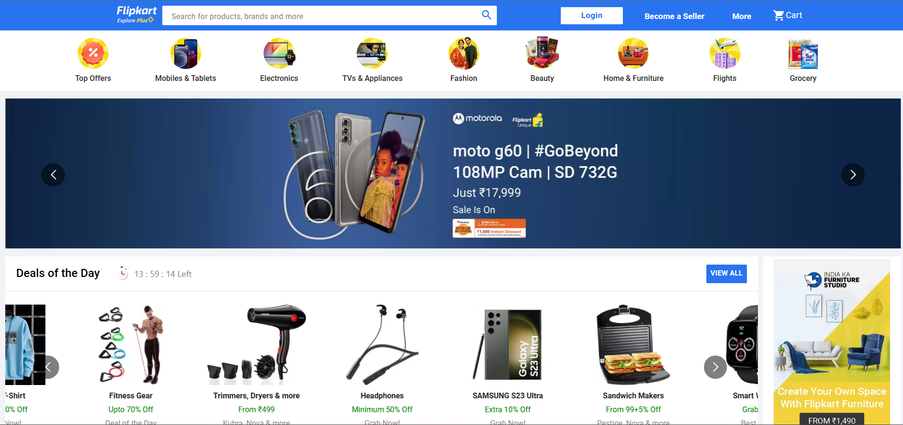
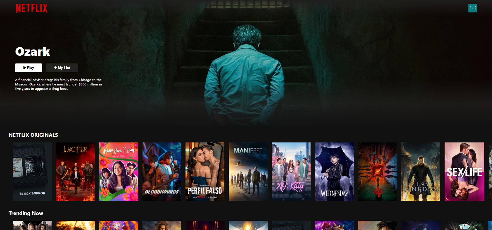
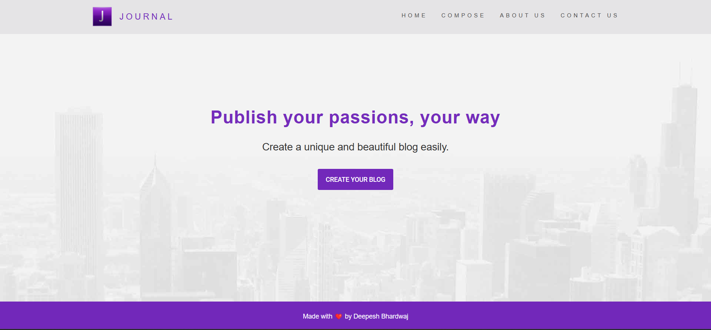
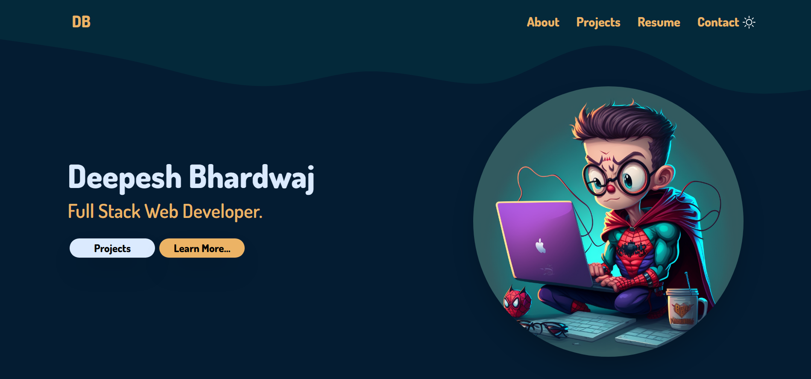

 

<!--Final do Contador de Visitas-->   
<!-- 
 -->
<!--  
<b>Visitors Count 👽 </b> 
   -->
<!-- 

  -->
<!--   -->
<!-- 
 -->
<h1 align="center" >Hi, I'm <a href="https://linkedin.com/in/deepesh16b" target="_blank">Deepesh Bhardwaj   </a> </h1>  

- 🌱 I’m currently improving my skills in **Web Development**

- 👯 I’m looking to collaborate on different projects

- 👨‍💻 All of my projects are available at **[My Website](https://deepesh16b.netlify.app)**

- 📝 I actively post on LinkedIn **[deepesh16b](https://www.linkedin.com/in/deepesh16b/)**
 
- 📫 How to reach me **deepeshbhardwaj58@gmail.com**
 

## Connect with me⚡

   
  
   
  
 

  

## Languages and Tools 🛠

 
  <!-- >
 &emsp;
   &emsp;
   &emsp;
    &emsp;
    &emsp;
   &emsp;
   &emsp;
   &emsp;
   &emsp;
  &emsp;
   &emsp;
   &emsp;
<-->
   
  
  
  
  
  
  
  
   
  

 

## Projects 🚀
<!-- <h1 align="center">Projects</h1> -->
<table bordercolor="#66b2b2">
  
  <tr>
    <td width="50%" valign="top">
      <h3 align="center">Flipkart Clone</h3>
         
        
         
        

           
  
  
      

        
<strong>React, Redux, Node, EJS, MongoDB, etc.</strong> - A clone of the Flipkart website built with React, Redux, Node, EJS, and MongoDB.

    </td>
    <td width="50%" valign="top">
      <h3 align="center">Netflix Clone</h3>
         
      
         
        

    
  
  
      

        
<strong>React, Redux, MongoDB, etc.</strong> - A clone of the Netflix website built with React, Redux, and MongoDB.

    </td>
  </tr>
  
  <tr>
    <td width="50%" valign="top">
      <h3 align="center">Blog Website</h3>
       
        
       
        

           
  
  
      

        
<strong>Node, EJS, MongoDB, etc.</strong> - A blog website where users can create and manage their own blogs.

</td>
   <td width="50%" valign="top">
  <h3 align="center">Portfolio Website</h3>
   
    
   
    

       
      
      
  

    
<strong>Used React and more</strong> - Portfolio website showcasing my projects and skills.

</td>

  </tr>
  
</table>

## GitHub Stats 📈

  

  

  

## Badges 🚀

